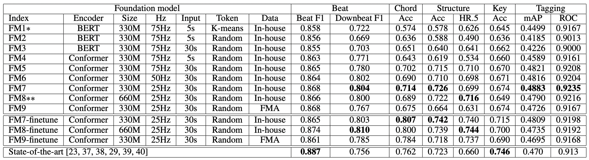
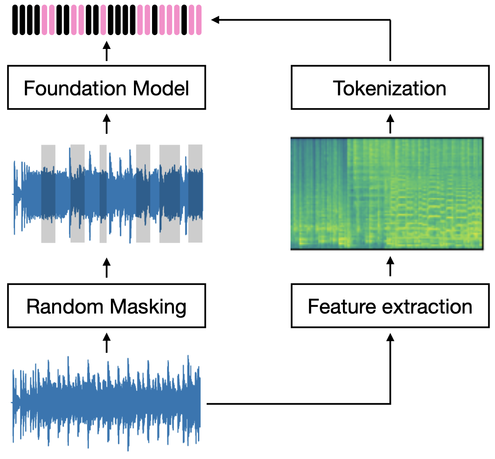

# MusicFM 🤖
[](https://opensource.org/licenses/MIT)
[](https://www.apache.org/licenses/LICENSE-2.0.html)


**A Foundation Model for Music Informatics**, ICASSP 2024 [[paper](https://arxiv.org/abs/2311.03318)]

-- Minz Won, Yun-Ning Hung, and Duc Le 


## Quick start
### Download models

**MusicFM-FMA**

- Pretrained using [FMA-large](https://github.com/mdeff/fma) data
	
```
wget -P YOUR_HOME_PATH/musicfm/data/ https://huggingface.co/minzwon/MusicFM/resolve/main/fma_stats.json
wget -P YOUR_HOME_PATH/musicfm/data/ https://huggingface.co/minzwon/MusicFM/resolve/main/pretrained_fma.pt
```
⚠️ The model checkpoint prior to Feb 13, 2024, was incorrect. Please ensure to re-download these files if you've been using previous versions.


**MusicFM-MSD**

- Pretrained with the entire [Million Song Dataset](http://millionsongdataset.com/)
- This version performs better than the FMA version
- This version is not introduced in the paper

```
wget -P YOUR_HOME_PATH/musicfm/data/ https://huggingface.co/minzwon/MusicFM/resolve/main/msd_stats.json
wget -P YOUR_HOME_PATH/musicfm/data/ https://huggingface.co/minzwon/MusicFM/resolve/main/pretrained_msd.pt
```

### Get embeddings
```
HOME_PATH = "/home/dev" # path where you cloned musicfm

import os
import sys
import torch

sys.path.append(HOME_PATH)
from musicfm.model.musicfm_25hz import MusicFM25Hz

# dummy audio (30 seconds, 24kHz)
wav = (torch.rand(4, 24000 * 30) - 0.5) * 2

# load MusicFM
musicfm = MusicFM25Hz(
    is_flash=False,
    stat_path=os.path.join(HOME_PATH, "musicfm", "data", "msd_stats.json"),
    model_path=os.path.join(HOME_PATH, "musicfm", "data", "pretrained_msd.pt"),
)

# to GPUs
wav = wav.cuda()
musicfm = musicfm.cuda()

# get embeddings
musicfm.eval()
emb = musicfm.get_latent(wav, layer_ix=7)
```

### Mixed precision and Flash attention
Suffering from memory issues? [Mixed precision](https://pytorch.org/tutorials/recipes/recipes/amp_recipe.html) and [Flash attention](https://arxiv.org/abs/2205.14135) will be good friends of yours!

```
# dummy audio (30 seconds, 24kHz)
wav = (torch.rand(4, 24000 * 30) - 0.5) * 2

# load MusicFM
musicfm = MusicFM25Hz(is_flash=True)

# to GPUs
wav = wav.cuda().half()
musicfm = musicfm.cuda().half()

# get embeddings
musicfm.eval()
emb = musicfm.get_latent(wav, layer_ix=7)
```

However, I highly recommend using `float32` for better performance in specific downstream tasks, such as beat tracking.

### Usage in downstream tasks
The pretrained model operates at a 25Hz frame rate, but our downstream tasks demand varying temporal resolutions. To address this, we either summarize the sequence through global average pooling or adjust the temporal resolution using adaptive average pooling. 

```
from torch import nn

# Sequence-level representation
seq_emb = emb.mean(-1) # (batch, time, channel) -> (batch, channel)

# Frame-level representation
"""
	n_frame = desired_temporal_resolution * sequence_length_in_sec
	300 frames = 10Hz * 30s in this example
	As a result, the sequence length becomes from 750 (25Hz * 30s) to 300
"""
n_frame = 300 
token_emb = nn.AdaptiveAvgPool1d(n_frame)(emb) # (batch, time, channel) -> (batch, time', channel)
```
We share the details of our downstream evaluation as follows. The selection of input lengths and temporal resolutions is based on our prior experience with each task.

|  | Beat | Chord | Structure | Key | Tagging |
| :--------: | :--------: | :--------: | :--------: | :--------: | :--------: |
| Input length | 6s | 12s | 24s | 12s | 29.1s |
| Temporal resolution | 50Hz | 16Hz | 8Hz | 0.5Hz | - |
| n_frame | 300 | 192 | 192 | 6 | 1 |

### Fine-tuning
You can expect better performance in downstream tasks by fine-tuning the foundation model. In this scenario, employ `musicfm.train()` and extract the final embeddings by setting `layer_ix=12`. However, when optimizing the model with the same learning rate, there's a risk of [catastrophic forgetting](https://en.wikipedia.org/wiki/Catastrophic_interference). To mitigate this issue, we utilized a learning rate of 1e-5 for the foundation model and 1e-4 for the probing layers.


## Results



\* FM1 is pretrained [MERT](https://arxiv.org/abs/2306.00107). 

\*\*FM8 mirrors the [BEST-RQ](https://arxiv.org/abs/2202.01855) but with the distinction that it was trained using music data.


- Random tokenization generalizes well to music data. 

- Frame-level classification offers a more comprehensive understanding of foundation models. While FM4 excels in music tagging, its performance in structural analysis is subpar.

- Input length used during training is critical for capturing
long-term contexts. Check 5s models (FM1, FM2, and FM4) and a 30s model (FM5) in downbeat tracking and structure analysis.

- Temporal resolution has less impact in our experimental setup. See FM5, FM6, and FM7.

- Model architecture makes a significant difference. Conformer (FM5) consistently outperformed BERT encoder (FM3) for across all downstream tasks. 

- The influence of model size was relatively minimal (FM7 and FM8). However, we observed that FM8's performance continued to improve, which is typically indicative of underfitting. All models were trained for two weeks to ensure a fair comparison.

- Data is undeniably crucial, as in any data-driven approach. Please compare FM7 and FM9.

- Fine-tuning the foundation model further enhances downstream performance. However, we did observe a performance
drop in the tagging task, primarily attributed to overfitting.

## Masked token modeling


MusicFM follows the training scheme of [BEST-RQ](https://arxiv.org/abs/2202.01855). Input audio is masked with noise, and the model predicts the masked representation. Target tokens are generated by random projection and a random codebook. Both the projection layer and codebook are **randomly initialized** and remain **non-trainable**. Isn't it fascinating?

Note that input normalization is exceptionally crucial, considering the usage of random projection. You can check the details [here](https://github.com/minzwon/musicfm/blob/d5d0f313add9f3c32c41f95521760b1a136809ed/model/musicfm_25hz.py#L148).

## Limitations
- Self-supervised foundation models in music, such as [JukeMIR](https://arxiv.org/abs/2107.05677), [MERT](https://arxiv.org/abs/2306.00107), and [MusicFM](https://arxiv.org/abs/2311.03318), consistently report relatively low performance in key detection. While fine-tuning the model can help bridge the performance gap, the foundation model itself does not appear to learn musical keys inherently. Further investigation is required to develop more advanced music foundation models.

- We share our model trained with the [FMA Dataset](https://github.com/mdeff/fma), which comprises 8k hours of Creative Common-licensed audio. While using a larger dataset (160k hours) can enhance performance, we've chosen to release the model trained on FMA to avoid potential licensing complications.

- Fine-tuned models for downstream tasks are not made publicly available as they are primarily used for evaluation purposes. It is expected that carefully designed backends beyond simple probing layers will improve downstream performance. I look forward to the contributions of other researchers with more expertise in each specific task.

- The downstream evaluation pipeline is not provided in this repository. Nonetheless, I believe creating a comprehensive evaluation pipeline is essential to expedite progress in music informatics research. I'm very open to discussing it together.


## Acknowledgement
We acknowledge and extend our sincere gratitude to Ju-Chiang Wang for his valuable contributions to data refinement and providing a crucial codebase for our downstream evaluation.

## Citation
```
@article{won2023musicfm,
    title={A Foundation Model for Music Informatics},
    author = {Won, Minz and Hung, Yun-Ning and Le, Duc},
    journal={arXiv preprint arXiv:2311.03318},
    year={2023}
}
```
